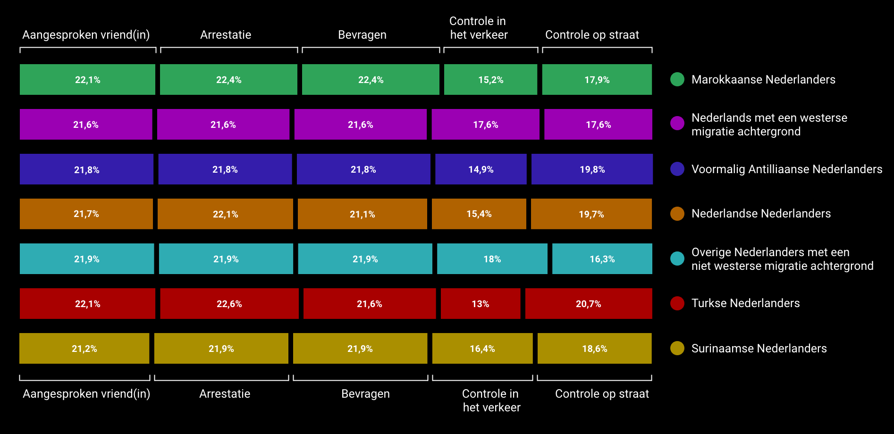
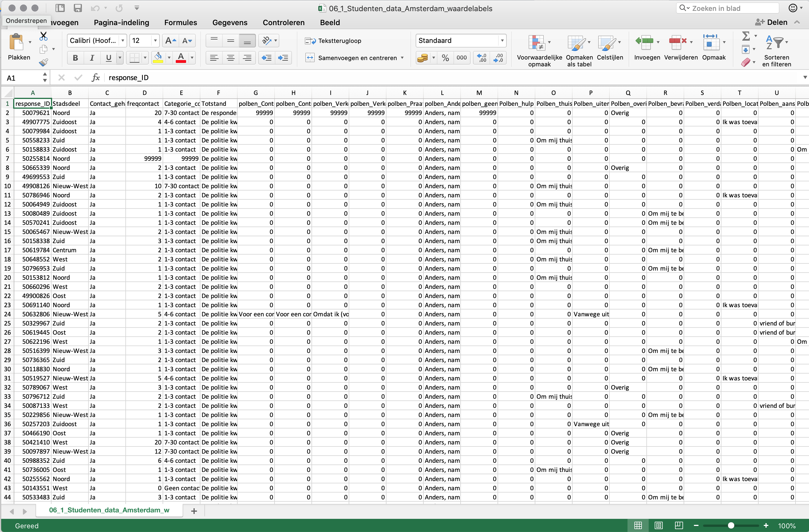
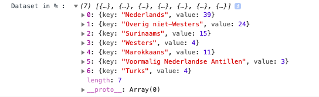

# Controle Alt Delete
[Link naar live demo](https://emmaoudmaijer.github.io/controlealtdelete-3/public/)

## Wie is onze opdrachtgever: Controle Alt Delete:

Door de Hogeschool van Amsterdam is ons een opdrachtgever toegewezen, Controle Alt Delete. Dit is een organisatie die zich focust op etnisch profileren bij de politie. Ze zetten zich in tegen etnisch profileren. Amnesty International is een samenwerkings- partner van Controle Alt Delete. Ze richten zich echter niet alleen op de politie maar ook op bijvoorbeeld BOA’s en de Koninklijke Marechaussee. Met dit project hebben we alleen met de politie te maken. Easy Solutions is een onderneming waar Controle Alt Delete een project van is. Ze verstoppen dit omdat Easy Solutions meerdere opdrachtgevers heeft die dit een heel spannend/politiek onderwerp kunnen vinden (denk aan de gemeente, etc.). Controle Alt Delete wordt als organisatie gepresenteerd, terwijl het eigenlijk een project is. Het is verder geregistreerd als een B.V. dat geen winst maakt. Wij burgers weten niet wat de omvang van etnisch profileren is. Daardoor kunnen wij niet meten of de maatregelen die de politie neemt het gewenste effect hebben.


## Het concept:
Ons concept laat verschillende variabelen zien zoals het aantal keer contact tussen de politie en de Amsterdamse respondenten, de manier van het contact en het vertrouwen in deze contact in verhouding met de culturele achtergrond van deze respondenten.

### Doelstelling
De doelstelling is om door middel van onafhankelijke onderzoek cijfers te verzamelen die sterke indicaties geven voor de omvang van etnisch profileren in Nederland.
Aan ons de vraag om deze data te doorzoeken, visueel inzichtelijk maken en aan te sluiten
op de huisstijl. Wij willen met dit project een verhaal vertellen en in procenten laten zien welke Nederlanders met een culturele afkomst het meest in contact is geweest met de politie in de afgelopen 12 maanden. Dit kan je zien in combinatie met hoeveel procent van de groep zelf naar de politie is gestapt of dat de politie naar hun kwam.

### Doelgroep
Onze website is bedoeld voor de orginatisoren van controle alt delete, maar ook voor mensen die vinden dat ze onterecht zijn behandeld door de politie en die via controle alt delete op deze pagina terecht zijn gekomen. Zo krijgen de bezoekers van de website een indicatie van hoe het contact met de politie tot stand komt en wat voor effect dit heeft met de culturele afkomsten. Ook is de website bedoeld voor de politie om hun ook een indicatie te geven van hoe het contact is verdeeld.

## De visualisaties

In totaal zijn er drie datavisualisaties te zien op deze pagina. Deze hebben te maken met de **culturele achtergronden** van de respondenten, welke van deze respondenten er **contact** hebben gehad met de politie en wie van hen er **op de politie is afgestapt of andersom**, hoe het **contact** tot stand is gekomen en hoeveel **vertrouwen** de respondenten hebben in de politie. 

**De bubble chart die je als eerst ziet:** In totaal zijn er 1934 respondenten geweest met verschillende culturele afkomsten, hiervan zijn er 794 in contact geweest met de politie in de afgelopen 12 maanden. Nederlandse Nederlanders het meest in contact geweest met de politie, gevolgd door overige Nederlanders met een niet Westerse migratieachtergrond en Surinamers. Je zou hieruit kunnen opmaken dat de kans aanwezig is dat de politie etnisch profileert. Alles in de bubble chart hebben we in procenten berekend zodat de verhoudingen dan eerlijker zijn en beter te vergelijken.

**De bar chart die je als tweede ziet:**
Bij deze bar chart hebben we gekeken naar hoe het contact met de politie en de respondent tot stand is gekomen. Zo is er te zien dat alleen Nederlanders met een Westerse migratieachtergrond en Nederlandse Nederlanders over het algemeen vaker zelf op de politie stappen en dat 
de rest van de culturele afkomsten vaker worden aangesproken door de politie.



**De scatterplot die je onderaan ziet:**
De grafiek onderaan de one pager is een scatterplot. Hieruit kun je aflezen wat de totstandkoming van het contact te maken heeft met het vertrouwen van de respondent. Je ziet twee losse grafieken. De bovenste is voor wanneer de politie naar de respondent zelf is toegestapt en de tweede is voor wanneer de respondent zelf naar de politie is gestapt. De cijfers onderaan staan voor het aantal vertrouwen dat de respondent in de politie heeft en de transparantie staat voor het aantal procent (met culturele achtergrond) die dat cijfer heeft gegeven. Op deze manier kan je zien dat iemand die zelf op de politie stapt over het algemeen meer vertrouwen heeft in de politie dan andersom.


## Data 
Controle Alt Delete heeft onderzoek gedaan door een enquête af te leggen in Amsterdam. Dit hebben zij gedaan om de ervaring van Amsterdammers met etnisch profileren in kaart te brengen. De respondenten hebben verschillende culturele afkomsten, namelijk: Nederlands, Marokkaans, Turks, Surinaams, Nederlands Antilliaans, etc. Een aantal respondenten hebben de vraag over de afkomst niet ingevuld. Deze respondenten zijn in de  datavisualisaties niet meegerekend. Door middel van onafhankelijk onderzoek cijfers verzamelen die sterke indicaties geven voor de omvang van etnisch profileren in Nederland. 

De antwoorden van de enquête werden aangeleverd als een csv bestand die we hebben omgezet naar een json file en vervolgens kon ik deze gaan opschonen.

      

```js
function dataOmzet() {
	let result = fetch("convertcsvdata.json")
		.then(data => data.json())
		.then(json => {
			const newResults = json.map(result => {
				return {
					id: result.response_ID,
					afkomst: result.Herkomst_def,
					totstand: result.Totstand,
					contact: result.Contact_gehad,
					freqcontact: result.freqcontact
				}
			})
			bubbleChart(newResults)
		})
}
dataOmzet()
```
Uit de data is hier de culturele afkomst, de totstandkoming, en het aantal keer contact opgehaald. Dit zullen we moeten groeperen zodat je een key en een value terug krijgt. Eerst hebben we de onbekende afkomsten en 99999 values weggehaald.

```js

function removeInvalidRecords(dataset) {
	var dataset_clean = [];

	for (var i = 0; i < dataset.length; i++) {
		var obj = dataset[i];
		if (obj.freqcontact != '99999' && obj.afkomst != 'Onbekend' && obj.afkomst != '#NULL!' && obj.afkomst != undefined) {

			dataset_clean.push(JSON.parse(JSON.stringify(dataset[i])));
			//total = total + obj.freqcontact;
		}
	}

	return dataset_clean;
}
```

Wij hebben ervoor gekozen om de respondenten met de culturele afkomst 'onbekend' weg te laten omdat wij ons vooral focussen op wat de culturele afkomst te maken heeft met de hoeveelheid contact met de politie. Onbekende afkomst is hierin onmogelijk te gebruiken omdat je daar geen vergelijkingen mee kan maken.
De 99999 waardes hebben wij eruit gelaten omdat dat de respondenten zijn die geen contact hebben gehad met met de politie, deze nemen wij niet mee in ons onderzoek omdat wij focussen op de mensen die wel contact hebben gehad.

**Data groeperen:**
```js
function rollupRecordsByCountry(data) {
			let transformed = d3.nest()
				.key(d => d.afkomst)
				.rollup(function (v) {
					return d3.sum(v, function (d) {
						return d.freqcontact;
					});
				})				
				.entries(data)
			return transformed
		}
		data = rollupRecordsByCountry(data)
```
Dit krijg je dan terug in de console als de data:



## Install project
Clone deze repository naar je computer:
```
git clone https://github.com/emmaoudmaijer/controlealtdelete-3.git
```
Ga naar de map in je terminal
```
cd frontend-data
```
Installeer packages
```
npm install
```
Om D3 in te laden, zet deze linkjes in je html:
```
    <script type="text/javascript" src="https://d3js.org/d3.v4.min.js"></script>
    <script src="https://d3js.org/d3-scale-chromatic.v1.min.js"></script>
```
Deze bubble chart is gemaakt met versie 4.

### Bronnen

**Voor de Bubble chart:**
* [Bron 1](https://bl.ocks.org/HarryStevens/54d01f118bc8d1f2c4ccd98235f33848)
* [Bron 2](https://www.d3-graph-gallery.com/graph/scatter_animation_start.html)
* [Bron 3](https://bl.ocks.org/ctufts/f38ef0187f98c537d791d24fda4a6ef9)
* [Bron 4](https://codepen.io/girliemac/pen/cDfmb/)
* [Bron 5](http://vallandingham.me/bubble_chart_v4/#)
* [Bron 6](https://bl.ocks.org/officeofjane/a70f4b44013d06b9c0a973f163d8ab7a/c5660429ab70f58ba18c6edc70f3a9ae92bcbf47)
* [Bron 7](https://stackoverflow.com/questions/39176404/d3-js-clustering-bubbles-to-segments)

**Slideshow**
* [Bron 1](https://bl.ocks.org/SpaceActuary/d6b5ca8e5fb17842d652d0de21e88a05)
* [Bron 2](https://www.w3schools.com/howto/howto_js_quotes_slideshow.asp)

## Licence
ISC - Emma Oudmaijer